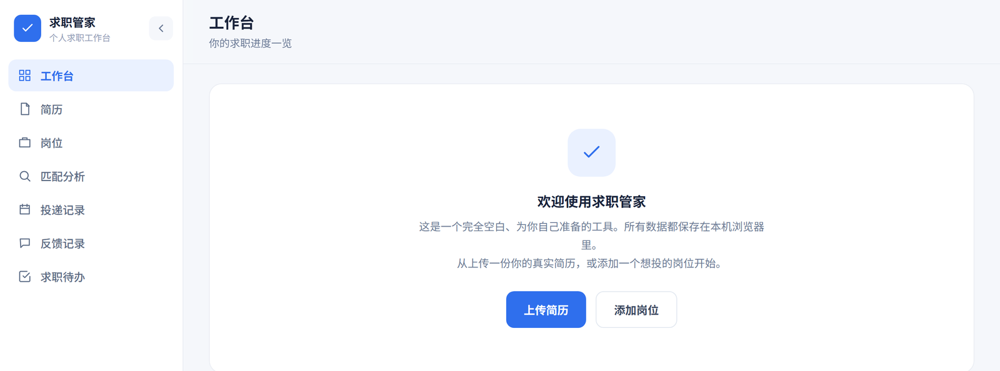
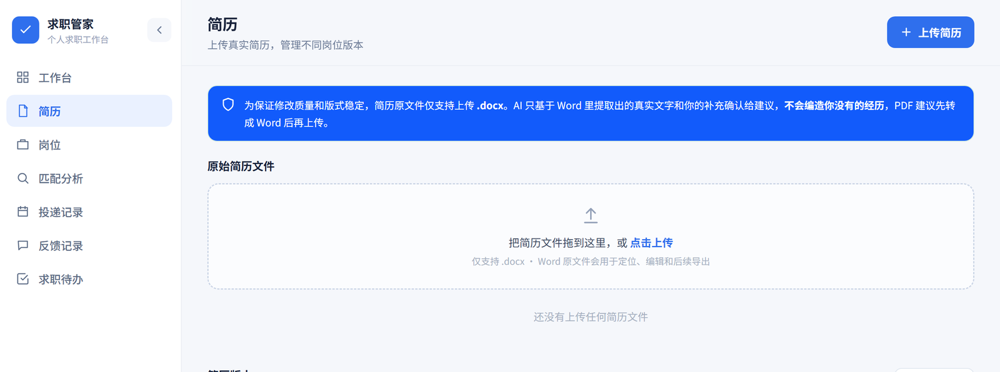
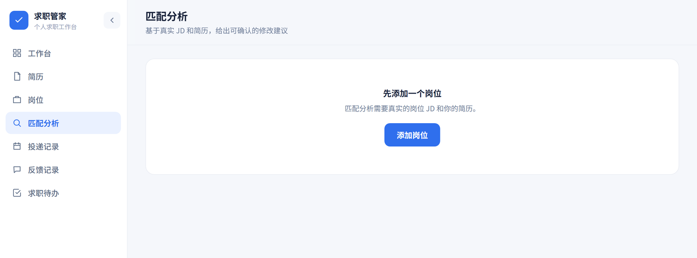
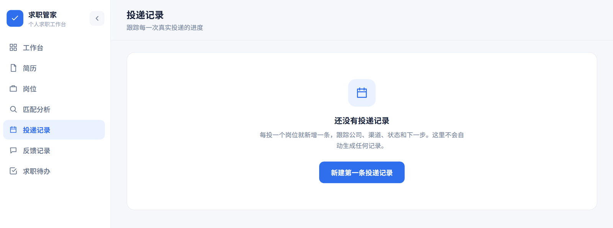

# 求职管家 Resume Assistant

一个面向个人求职流程的轻量 Web 工作台，用来管理简历版本、岗位 JD、匹配分析、投递记录、企业反馈和求职待办。前端是单页工具，后端用 Node.js/Express 提供登录、数据持久化和 DeepSeek API 安全代理，API Key 只保存在服务器环境变量中，不会暴露给浏览器。

> 本项目适合个人自托管使用。AI 输出用于辅助整理、匹配和改写，投递前请自行核对真实性与准确性。

## 界面预览



| 简历管理 | 匹配分析 |
| --- | --- |
|  |  |



## 功能亮点

- **简历管理**：上传 `.docx` 简历、提取文本、维护不同岗位方向的简历版本，并支持导出 Word。
- **岗位管理**：粘贴 JD 后保存公司、岗位、城市、投递链接与来源备注。
- **AI 匹配分析**：基于真实 JD 与简历文本分析匹配点、缺口、风险提醒和修改重点。
- **简历改写建议**：只在原简历事实基础上优化表达，标记需要用户确认的信息，不替用户编造经历。
- **投递材料生成**：生成可编辑的投递摘要、邮件草稿、面试准备要点和跟进待办。
- **投递进度跟踪**：记录投递状态、渠道、下一步事项，支持导出投递记录 CSV。
- **反馈与待办**：手动记录企业反馈，并把面试准备、补材料、跟进等事项沉淀为待办。
- **多用户登录**：支持注册/登录，生产环境可关闭注册入口，避免公开部署后被陌生人使用。

## 技术栈

- 前端：原生 HTML/CSS/JavaScript、`support.js`
- 文档处理：Mammoth、docx-preview、JSZip
- 后端：Node.js 18+、Express、OpenAI SDK DeepSeek-compatible API
- 存储：本地 JSON 文件，或腾讯云 CloudBase 云数据库/云存储
- 部署：Render Blueprint、Docker、腾讯云轻量应用服务器/CVM

## 项目结构

```text
.
├── 求职管家.dc.html              # 前端主页面
├── login.html                    # 登录/注册页面
├── support.js                    # 前端运行时辅助脚本
├── server/                       # Node/Express 后端
│   ├── server.js                 # API、静态文件托管、登录门禁
│   ├── lib/
│   │   ├── auth.js               # 用户、会话、数据与文件持久化
│   │   └── deepseek.js           # DeepSeek 调用封装
│   ├── .env.example              # 环境变量示例
│   └── README.md                 # 后端接口说明
├── deploy/tencent-cloud/          # 腾讯云部署模板与说明
├── Dockerfile                     # 容器部署
└── render.yaml                    # Render Blueprint
```

## 本地启动

准备 Node.js 18+，建议使用 Node.js 20。

```bash
cd server
cp .env.example .env
npm install
npm start
```

Windows PowerShell 可用：

```powershell
cd server
copy .env.example .env
npm install
npm start
```

然后编辑 `server/.env`，至少填写：

```env
DEEPSEEK_API_KEY=你的 DeepSeek API Key
SESSION_SECRET=一段随机长字符串
```

启动后访问：

```text
http://localhost:3000
```

首次进入可注册账号。创建好自己的账号后，如果是公网环境，建议把 `ALLOW_REGISTRATION=false`，再重启服务。

## 环境变量

| 变量 | 必填 | 说明 |
| --- | --- | --- |
| `DEEPSEEK_API_KEY` | 是 | DeepSeek API Key，只能放在本地或服务器环境变量中。 |
| `DEEPSEEK_MODEL` | 否 | 默认模型，示例配置为 `deepseek-v4-flash`。 |
| `DEEPSEEK_MODEL_PRO` | 否 | 简历深度改写优先使用的模型，示例配置为 `deepseek-v4-pro`。 |
| `PORT` | 否 | 服务端口，默认 `3000`。 |
| `HOST` | 否 | 监听地址。CVM + Nginx 手动部署时可设为 `127.0.0.1`。 |
| `SESSION_SECRET` | 生产必填 | 登录会话签名密钥。生产环境必须固定配置，否则重启后登录态会失效。 |
| `ALLOW_REGISTRATION` | 否 | 是否开放注册，默认 `true`。公网创建好账号后建议设为 `false`。 |
| `AUTH_DATA_DIR` | 生产建议 | 本地文件模式的数据目录。Render 等容器平台应指向持久磁盘。 |
| `TCB_ENV_ID` | 否 | 腾讯云 CloudBase 环境 ID。配置后账号、业务数据与简历原文件可持久化到云端。 |

更多后端接口和错误约定见 [`server/README.md`](./server/README.md)。

## 部署

### Render

仓库根目录包含 `render.yaml`，可作为 Render Blueprint 使用。创建服务后，在 Render 控制台填写 `DEEPSEEK_API_KEY`，确认 `SESSION_SECRET` 已生成，并使用持久磁盘保存 `AUTH_DATA_DIR=/var/data/resume-assistant`。

### Docker

```bash
docker build -t resume-assistant .
docker run -p 3000:3000 \
  -e DEEPSEEK_API_KEY=你的 DeepSeek API Key \
  -e SESSION_SECRET=一段随机长字符串 \
  -e ALLOW_REGISTRATION=true \
  resume-assistant
```

如需保存账号、业务数据和上传文件，请把 `AUTH_DATA_DIR` 挂载到容器外部持久目录。

### 腾讯云

腾讯云轻量应用服务器 / CVM 部署说明见 [`deploy/tencent-cloud/README.md`](./deploy/tencent-cloud/README.md)。如果使用 CloudBase 云托管，请先阅读 [`deploy/tencent-cloud/cloudbase-persistence.md`](./deploy/tencent-cloud/cloudbase-persistence.md)。

## 公开仓库前检查

- 不要提交真实的 `.env`、API Key、Token、Cookie 或服务器凭据。
- 不要提交个人简历、投递记录、企业反馈、账号数据或带个人信息的截图。
- 如果曾经把 Key 写进代码或提交历史，请先吊销旧 Key，重新生成新 Key。
- 公网部署必须配置固定的 `SESSION_SECRET`。
- 公网创建好自己的账号后，建议设置 `ALLOW_REGISTRATION=false`。
- 容器或云托管环境要挂载持久目录，或配置 CloudBase，避免重启/重新部署后数据丢失。

## 数据与隐私

本项目默认把账号、业务数据和上传文件保存到后端配置的存储中：本地开发为 `server/data`，生产环境可使用持久磁盘或 CloudBase。`server/data/`、`.env`、`uploads/` 等路径已被 `.gitignore` 忽略。

AI 分析会把你提供的 JD 与简历文本发送给 DeepSeek API。请确认你有权处理这些内容，并避免上传不必要的敏感信息。

## License

本仓库暂未添加开源许可证。公开仓库前，如希望他人复用、修改或分发，请补充合适的 `LICENSE` 文件。
